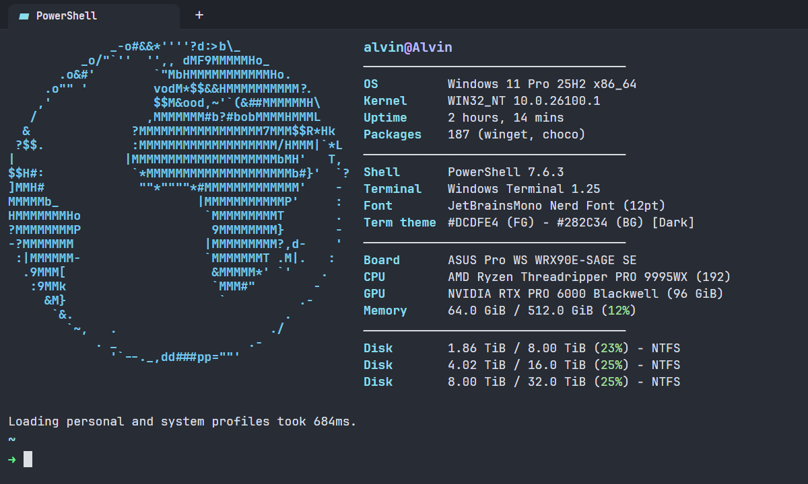

# PowerShell dotfiles

A small Windows-first PowerShell setup with a clean prompt, useful shell integrations, and a Fastfetch greeting. It is meant to be easy to understand, easy to change, and safe to copy between machines.

## Preview



## Included

- Oh My Posh prompt with path, Git state, Node version, and exit status
- UTF-8 console defaults and Windows Terminal working-directory handoff
- Fastfetch greeting using the current Windows user and PC name
- zoxide, Chocolatey, uv, and uvx integrations when installed
- `py` alias for Python and `venv` helper for the local `.venv`

## Install

Install the optional tools you want first. The profile checks for each command, so missing tools are simply skipped.

```powershell
winget install JanDeDobbeleer.OhMyPosh ajeetdsouza.zoxide fastfetch-cli.fastfetch astral-sh.uv
git clone https://github.com/alvin-cmd/powershell-dotfiles "$HOME\dotfiles"
& "$HOME\dotfiles\install.ps1" -Force
```

`install.ps1` creates hard links for the PowerShell profile and configuration files. Existing files are backed up with a timestamp when `-Force` is supplied. Re-run it after cloning on another Windows machine.

## Larp mode

Want the globe and your own `user@pc` title with a fictional high-end spec sheet? Install with `-Larp` instead:

```powershell
git clone https://github.com/alvin-cmd/powershell-dotfiles "$HOME\dotfiles"
& "$HOME\dotfiles\install.ps1" -Force -Larp
```

Run the normal `-Force` command again to switch back to real system information.

## Layout

```text
.
├── .config/
│   ├── fastfetch/config.jsonc
│   └── oh-my-posh/star.omp.json
├── PowerShell/Microsoft.PowerShell_profile.ps1
└── install.ps1
```

## Notes

- This is a Windows PowerShell 7 setup.
- The Fastfetch title uses the current Windows user and PC name; no identity is stored in the configuration.
- Make changes in this repository after installing it. The linked files update immediately.
